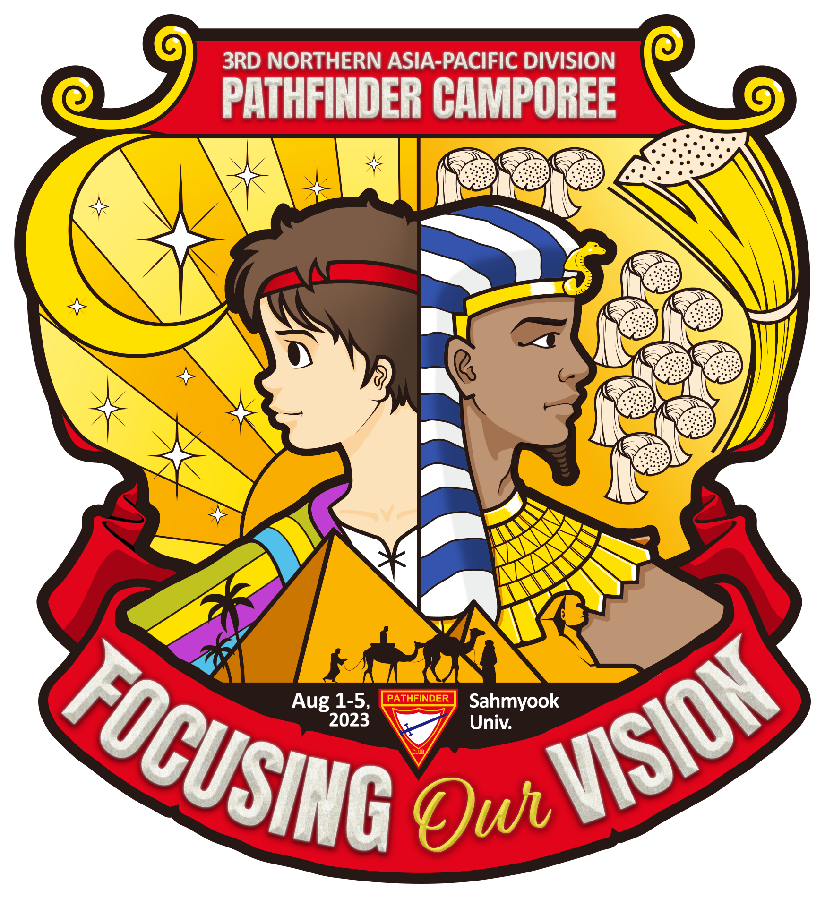

# NSD캠포리 종합 운영 메뉴얼


스마트 폰으로 접속 시 화면 상단 왼쪽 위 ≡ 아이콘을 터치하면 목록이 나옵니다.



이 페이지 링크는 캠포리 운영진에게만 공유해주시기 부탁드립니다.


## 캠포리 홍보 유튜브



## 북아시아태평양지회(NSD) 소개

북아시아 태평양 지회(NSD)는 세계에서 가장 도전적인 지역 중 하나입니다. 이 지역은 몽골, 일본, 대만, 북한, 대한민국의 광대한 영토를 포함할 뿐만 아니라 2억 3천만 명의 사람들이 거주하고 있습니다. 세속주의와 물질주의, 무신론과 철학의 만리장성 앞에서 우리는 메뚜기 같을지라도 그리스도께서 약속하신 성령의 능력으로 그 사명을 성공적으로 완수하기 위해 헌신하고 있습니다.

내용편집

## 패스파인더 클럽 소개

### 패스파인더 클럽이란?

패스파인더 클럽은 10-15세 청소년을 위해 제칠일안식일예수재림교회가 후원하는 세계적인 조직입니다. 이 프로그램은 재미있고 상호 작용하는 방식으로 영적, 정신적, 육체적, 사회적 기술을 개발하도록 설계되었습니다. 청소년들이 캠핑, 등산, 봉사활동, 실기 학습 등 다양한 활동에 참여하면서 인성과 리더십 자질을 함양할 수 있도록 합니다. Pathfinder Club은 젊은이들이 가족, 교회 및 지역 사회에 긍정적으로 기여할 책임감 있고 성숙한 개인으로 성장하도록 돕는 것을 목표로 합니다.

### 패스파인더 클럽의 목적은?

1911년 타코마 팍에서 처음 조직되어 대총회 청소년부 산하에 개척대 부서를 두고 세계적인 활동으로 성장해왔으며 현재 300여만명의 회원들이 패스파인더 클럽에서 활동하고 있습니다. 5년에 한 번씩 열리는 세계 패스파인더 캠포리에는 5만명 이상이 참가하여 국제적인 친교를 나누며 복음사명을 위한 헌신을 새롭게 하고 있습니다.

## NSD 패스파인더 캠포리란?

2023년 제 3회로 열리는 북아시아 태평양지회 캠포리는 한국, 일본, 몽골, 대만 등 북아시아태평양지회 지역뿐만 아니라 미국, 필리핀, 태국 등 여러 해외에서도 참여하는 국제적인 패스파인더 축제입니다.

### 캠포리의 중요성

한국 재림교회는 100년 이상의 전통과 경쟁력을 가진 패스파인더 프로그램을 확산시켜 교회마다 어린이 청소년 사역을 전문화, 체계화 시키려는 노력을 하고 있습니다. 금번 캠포리는 국제적인 친교를 통하여 우리의 어린이 청소년들이 교회에 대한 자부심을 가지며, 더 큰 비전과 선교사명을 심어줌으로 미래의 남은 교회의 지도자로 설 수 있는 장을 마련하는 중요한 축제가 될 것입니다.

## 캠포리의 개요

> * 주 제 : Focusing our vision(요셉)
> * 기 간 : 2023. 8.1(화)-5(토)
> * 장 소 : 삼육대학교, 한국삼육중고등학교, 태강삼육초등학교
> * 참가인원 : 4,000명 (등록인원 2,500명)\
>   (한국 3,700명, 대만 100명, 몽골 50명, 일본 50명, 미국 100명, 기타)
> * 강 사 : 최호영 목사(북아시아태평양지회 청소년부장), 안드레스 페랄타 목사(대총회 패스파인더 부장)
> * 주 관 : 한국연합회 및 5개 합회
> * 주 최 : 북아태지회

## 캠포리 주제패치

<figure><figcaption></figcaption></figure>

## 주요 페이지 링크


[1.md](outline/1.md)



[schedule.md](outline/schedule.md)



[team1](team1/)



[pdf.md](undefined/team1/pdf.md)



[undefined.md](undefined.md)


## 캠포리포스터

<figure><figcaption></figcaption></figure>
