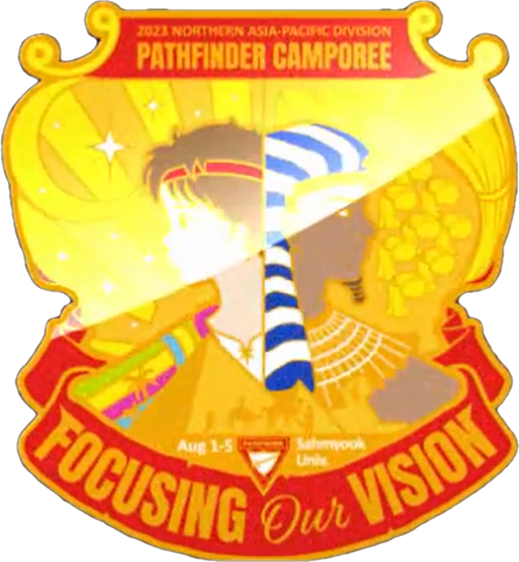
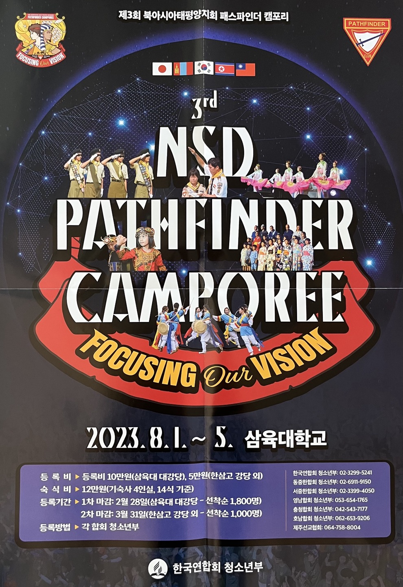

# NSD캠포리 종합 운영 메뉴얼


스마트 폰으로 접속 시 화면 상단 왼쪽 위 ≡ 아이콘을 터치하면 목록이 나옵니다.


## 캠포리 홍보 유튜브



## 캠포리의 개요

> * 기 간 : 2023. 8.1(화)-5(토)
> * 장 소 : 삼육대학교
> * 참가인원 : 4,000명 (등록인원 2,500명)\
>   (한국 3,700명, 대만 100명, 몽골 50명, 일본 50명, 미국 100명, 기타)
> * 강 사 : Busi Kamlalo(대총회 청소년부장), 안드레스 (대총회 패파부장)

## 캠포리 주제패치

<figure><figcaption></figcaption></figure>

## 주요 페이지 링크


[1.md](outline/1.md)



[schedule.md](outline/schedule.md)



[team1](team1/)



[pdf.md](undefined/team1/pdf.md)


## 캠포리포스터

<figure><figcaption></figcaption></figure>
