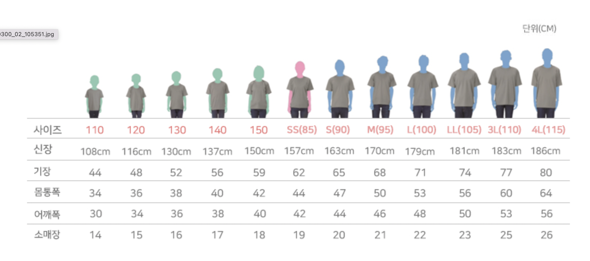

# 각 합회 등록 담당자 확인사항

#### Q. 등록의 선착순 기준을 어떻게 할 것인가?

A. 모든 합회가 신청서와 등록비를 같이 내야 등록이 완료된다.

#### Q. 등록 나이 제한을 두어야 하는가?

A. 만 4세 미만(48개월 미만) 은 등록비가 없는 것으로 결정한다.

A. 대강당 좌석은 아이를 부모가 안고 참석하게하여 자리를 차지하지 않게 허용한다.

#### Q. 숙소 배정에 인원은  몇 명인가?해

삼육대에서 가용인원을 정확하게 정해주지 않았다.

기숙사 사용이 전체 1000명이나, 삼육대 계절학기 상황에 따라 300명이 줄은 700명만 쓸 수 있게 된다. (2023년 6월에 확정)

A. 기숙사 자리가 부족하므로 선착순으로 배정해야 할 수 있다.

&#x20;

#### Q. 환불에 관한 규정이 필요하다.

등록과 행사의 기간이 6-8개월의 간격의 차이가 있다.

A. 서중한 합회가 환불규정을 만들어 안내했고 모든 합회가 통일한다.


등록취소시 환불규정&#x20;

4.5(수)까지 100% 환불

5.3(수)까지 50% 환불

5.4(목)부터 환불불가


#### Q. 숙박에서 남녀가 구분되어야 하는 상황이다.

그런데 한교회 8명중 7명이 여자아이인데 1명남자아이가 5세인 상황이다. 어떻게 기숙사를 배정해야하는가?

학교에 맞춰서 남여 기숙사에 맞춰서 남녀 배정을 해야 한다. 그러나 몇 세 이하일 경우 성별을 무관하게 이용해도 되게 할 것인가?

A. 숙소(기숙사)는 무조건 남녀 구분을 한다.

A. 아이를 캐어 할 수 있는 교회 내의 동성 지도자가 있을 경우만 숙소(기숙사)배정이 가능하고 이 조건이 안될 시 텐트로 배정한다.

&#x20;

#### Q. 외부 숙소일 경우(동,서중한) 행사 중 쉴 공간, 쉼터가 없을 시 어디서 식사를 할 수 있을까?

A. 건물 중 합회 별 쉼터를 마련해주면 어떨까?

#### Q. 등록비에 대한 영수증을 끊어 주는 것에 대한 문제?

A. 연합회가 영수증 양식을 제공하고 합회별로 각 교회로 등록비에 대한 영수증을 만들어 준다.

담당자는 각 합회별 캠포리 재무가 할 수 있다

&#x20;

#### Q. 등록시 티 사이즈가 혼란이 된다.

A. 한글파일에 기록된 사이즈가 아니라, 모모티 그림파일사이즈가 기준이 된다.

<figure><figcaption>
모모티 사이즈 안내표
</figcaption></figure>

&#x20;

#### Q. 타프설치 가능한가?

A. 현 상황에서 교회별 타프 허용을 할 수 없다.

&#x20;

#### Q. 취사 가능한가?

A. 삼육대전체 취사 불가능하다.

&#x20;

#### Q. 침례식을 안식일 오후에 하는데 침례식만 참석하는 침례대상자가 있는 경우 등록시 어떻게 하는가?

A. 원데이 패스를 만들 것 같다. 아직 논의가 안되었다.

안식일에는 원데이 패스 없이 모두 받을 것 같다. <mark style="color:orange;">교회에는 아직 안내하지 말자.</mark>

&#x20;

#### Q. 모든 합회가 등록상황을 공유할 필요가 있다.

A. 매주 월요일 저녁 7시에 공유한다.

#### 기타 안내

방 자체를 합회별로 나눌 수 있게 한다.

캠핑카 입장 불가하다.
