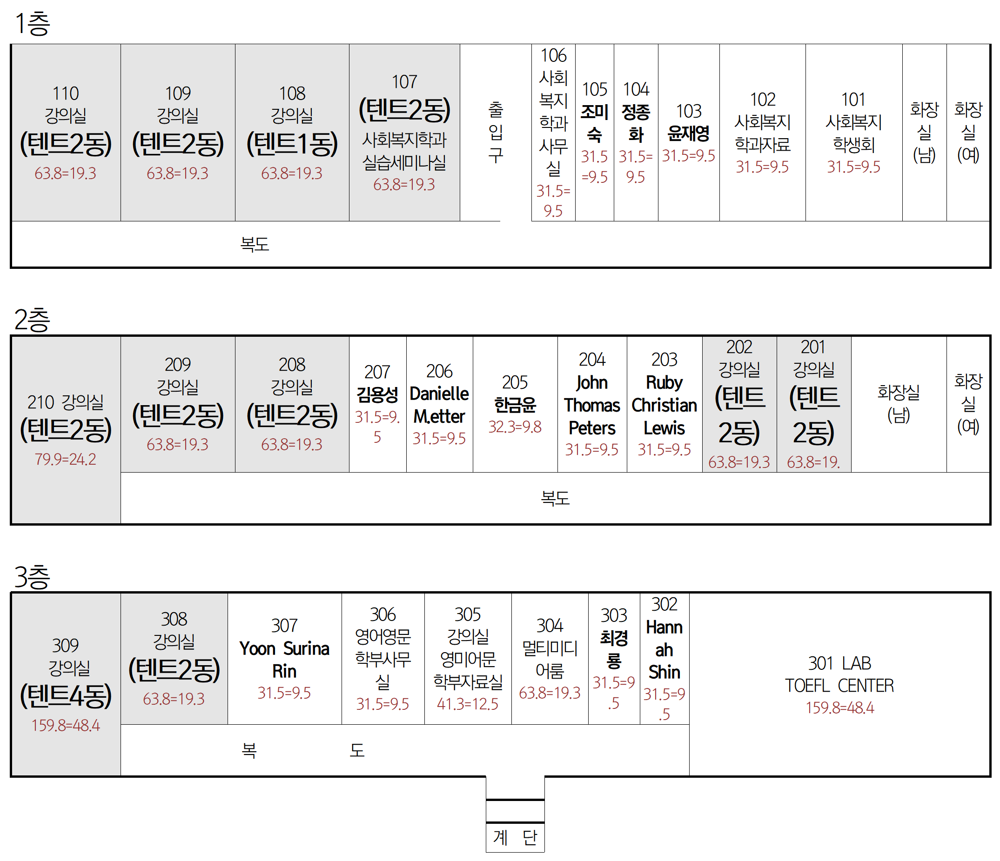
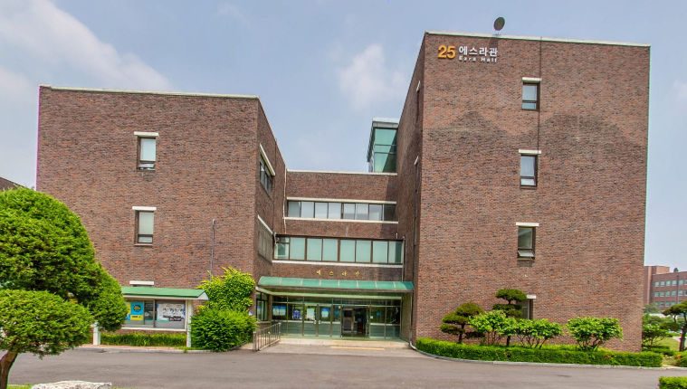

# 숙박 장소 안내 (초안)

## 실내(강의실) 텐트 설치 장소



### 1. 사무엘관

#### 강의실 별 텐트 동수

|  층  |   호  | 텐트동 |
| :-: | :--: | :-: |
|  1층 | 107호 |  2  |
|     | 108호 |  1  |
|     | 109호 |  2  |
|     | 110호 |  2  |
|  2층 | 201호 |  2  |
|     | 202호 |  2  |
|     | 208호 |  2  |
|     | 209호 |  2  |
|     | 210호 |  2  |
|  3층 | 308호 |  2  |
|     | 309호 |  4  |
|  총  |      | 23동 |

####

#### 사무엘관 평면도

<figure><figcaption></figcaption></figure>

#### 사무엘관 전경

<figure><figcaption></figcaption></figure>



### 2. 신학관

#### 강의실 별 텐트 동 수

|  층  |   호  | 텐트동 |
| :-: | :--: | :-: |
|  1층 | 103호 |  2  |
|     | 109호 |  1  |
|  2층 | 201호 |  2  |
|     | 202호 |  3  |
|     | 203호 |  3  |
|     | 208호 |  3  |
|     | 210호 |  2  |
|  총  |      | 16동 |

####

#### 신학관 평면도

<figure><figcaption></figcaption></figure>

#### 신학관 전경

<figure><figcaption></figcaption></figure>



### 3. 에스라관

#### 강의실 별 텐트 동 수

|  층  |   호  | 텐트동 |
| :-: | :--: | :-: |
|  1층 | 114호 |  3  |
|  2층 | 210호 |  2  |
|  3층 | 305호 |  2  |
|     | 306호 |  2  |
|  총  |      |  9동 |

####

#### 에스라관 평면도

<figure><figcaption></figcaption></figure>

#### 에스라관 전경

<figure><figcaption></figcaption></figure>



### 4. 바울관

#### 강의실 별 텐트 동 수

|  층  |   호  | 텐트동 |
| :-: | :--: | :-: |
|  2층 | 202호 |  2  |
|     | 203호 |  2  |
|     | 207호 |  1  |
|     | 214호 |  2  |
|  3층 | 301호 |  2  |
|     | 306호 |  2  |
|     | 312호 |  2  |
|     | 313호 |  2  |
|  4층 | 401호 |  1  |
|     | 403호 |  1  |
|  총  |      | 17동 |

####

#### 바울관 평면도

<figure><figcaption></figcaption></figure>

#### 바울관 전경

<figure><figcaption></figcaption></figure>



### 5. 제2과학관

#### 강의실 별 텐트 동 수

|  층  |   호  | 텐트동 |
| :-: | :--: | :-: |
|  1층 | 106호 |  2  |
|  3층 | 307호 |  2  |
|  총  |      |  4동 |

####

#### 제2과학관 평면도

<figure><figcaption></figcaption></figure>

#### 제2과학관 전경

<figure><figcaption></figcaption></figure>



## 실외 텐트 설치 장소

## 기숙사 안내

