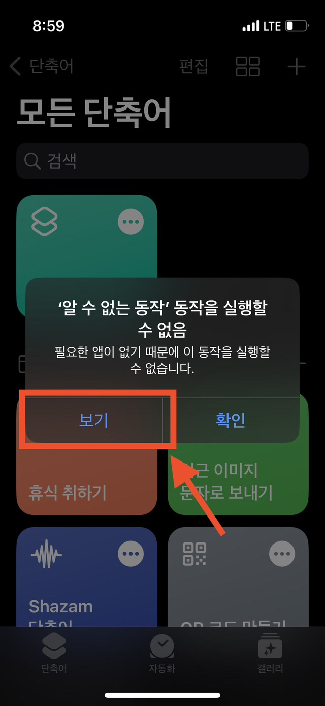

# 아이폰 홈에 바로가기 추가하기


본 페이지의 링크를 매번 카톡 방에 들어와 링크 주소를 찾아 누르는 번거로움을 피하고자 마련했습니다. 아이폰에 구글 'chrome' 앱을 먼저 설치하시면 좋습니다.


### 1. 다음 링크 'Shortcuts'를 터치





### **2. '단축키 가져오기' 터치**

<figure><figcaption></figcaption></figure>

### **3. '단축어 추가' 터치**

<figure><figcaption></figcaption></figure>

### **4. NSD 운영자료 오른쪽 상단 위 '더보기 아이콘' 터치**

<figure><figcaption></figcaption></figure>

### 5. 팝업 창의 '보기'를 터치

<figure><figcaption></figcaption></figure>

##

### 6. 팝업 창의 'App Store에서 보기' 를 터치

<figure><figcaption></figcaption></figure>

### 7. Google Chrome 앱을 '받기'

<figure><figcaption></figcaption></figure>

### 8.  설치한 Google Chrome 앱을 터치하여열어 초기 설정 완료

### 9.  아이폰의 '단축어' 앱을 터치

### 10.  **NSD 운영자료 오른쪽 상단 위 '더보기 아이콘' 터치**

<figure><figcaption></figcaption></figure>

### **11. 하단 탭에서 '공유 아이콘' 터치**

<figure><figcaption></figcaption></figure>

### **12. '홈 화면에 추가' 터**

<figure><figcaption></figcaption></figure>

### **13. 오른쪽 상단 '추가' 터치**

<figure><figcaption></figcaption></figure>

### **14. 아이폰 홈 화면에 추가 완료**

<figure><figcaption></figcaption></figure>



### **2. '단축키 가져오기' 터치**

<figure><figcaption></figcaption></figure>

### **3. '단축어 추가' 터치**

<figure><figcaption></figcaption></figure>

### **4. 단축어 오른쪽 상단 위 '더보기 아이콘' 터치**

<figure><figcaption></figcaption></figure>

### **5. 하단 탭에서 '공유 아이콘' 터치**

<figure><figcaption></figcaption></figure>

### **6. '홈 화면에 추가' 터**

<figure><figcaption></figcaption></figure>

### **7. 오른쪽 상단 '추가' 터치**

<figure><figcaption></figcaption></figure>

### **8. 아이폰 홈 화면에 추가 완료**

<figure><figcaption></figcaption></figure>


